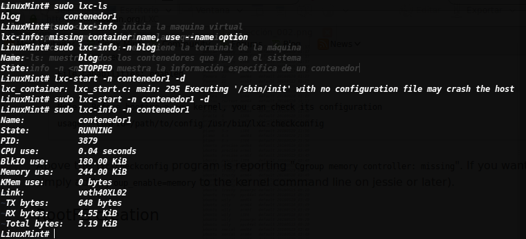

# Introducción

Linux Containers (LXC) provee una forma de virtualización a nivel software, permitiendo correr varias máquinas virtuales simultaneamente. Estas unidades estan suficientemente aisladas pero pueden utilizar los recursos de la máquina de forma eficiente

## Instalación

Para la instalación se debe descargar el paquete lxc, en debian seria:

```bash
apt-get install lxc
```

## Configuración

Primero checamos si el sistema puede soportar contenedores

```bash
# lxc-checkconfig
LinuxMint# lxc-checkconfig 
Kernel configuration not found at /proc/config.gz; searching...
Kernel configuration found at /boot/config-3.19.0-32-generic
--- Namespaces ---
Namespaces: enabled
Utsname namespace: enabled
Ipc namespace: enabled
Pid namespace: enabled
User namespace: enabled
Network namespace: enabled
Multiple /dev/pts instances: enabled

--- Control groups ---
Cgroup: enabled
Cgroup clone_children flag: enabled
Cgroup device: enabled
Cgroup sched: enabled
Cgroup cpu account: enabled
Cgroup memory controller: enabled
Cgroup cpuset: enabled

--- Misc ---
Veth pair device: enabled
Macvlan: enabled
Vlan: enabled
Bridges: enabled
Advanced netfilter: enabled
CONFIG_NF_NAT_IPV4: enabled
CONFIG_NF_NAT_IPV6: enabled
CONFIG_IP_NF_TARGET_MASQUERADE: enabled
CONFIG_IP6_NF_TARGET_MASQUERADE: enabled
CONFIG_NETFILTER_XT_TARGET_CHECKSUM: enabled

--- Checkpoint/Restore ---
checkpoint restore: enabled
CONFIG_FHANDLE: enabled
CONFIG_EVENTFD: enabled
CONFIG_EPOLL: enabled
CONFIG_UNIX_DIAG: enabled
CONFIG_INET_DIAG: enabled
CONFIG_PACKET_DIAG: enabled
CONFIG_NETLINK_DIAG: enabled
File capabilities: enabled

Note : Before booting a new kernel, you can check its configuration
usage : CONFIG=/path/to/config /usr/bin/lxc-checkconfig

LinuxMint#
```

## Creación

Después de haber revisado que el sistema soporta los contenedores podemos comenzar a crear, para eso se utiliza el comando lxc-create

```bash
lxc-create -n <nombre> -t <template>

# lxc-create -n contenedor -t download

DIST    RELEASE ARCH    VARIANT BUILD
debian  wheezy  amd64   default 20160519_01:37
debian  wheezy  armel   default 20160519_01:37
debian  wheezy  armhf   default 20160519_01:37
debian  wheezy  i386    default 20160519_01:37
debian  wheezy  powerpc default 20160516_22:42
debian  wheezy  s390x   default 20160517_22:42
fedora  22      amd64   default 20160520_01:27
fedora  22      armhf   default 20160112_01:27
fedora  22      i386    default 20160520_01:27
fedora  23      amd64   default 20160520_01:27
fedora  23      i386    default 20160520_01:27
gentoo  current amd64   default 20160520_14:12
gentoo  current i386    default 20160520_14:12
oracle  6       amd64   default 20160520_11:40
oracle  6       i386    default 20160520_11:40
oracle  7       amd64   default 20160520_11:40
plamo   5.x     amd64   default 20160520_21:36
plamo   5.x     i386    default 20160520_21:36
plamo   6.x     amd64   default 20160520_21:36
plamo   6.x     i386    default 20160520_21:36
ubuntu  precise amd64   default 20160519_03:49
ubuntu  precise armel   default 20160519_03:49
ubuntu  precise armhf   default 20160519_03:49
ubuntu  precise i386    default 20160518_03:49
ubuntu  precise powerpc default 20160517_03:49
ubuntu  trusty  amd64   default 20160519_03:49
ubuntu  trusty  arm64   default 20160518_03:49
ubuntu  trusty  armhf   default 20160519_03:49
ubuntu  trusty  i386    default 20160519_03:49
ubuntu  trusty  powerpc default 20160515_09:20
ubuntu  trusty  ppc64el default 20160515_09:20
ubuntu  wily    amd64   default 20160519_03:49
ubuntu  wily    arm64   default 20160518_03:49
ubuntu  wily    armhf   default 20160519_03:49
ubuntu  wily    i386    default 20160518_03:49
ubuntu  wily    powerpc default 20160515_09:20
ubuntu  wily    ppc64el default 20160515_09:20
ubuntu  xenial  amd64   default 20160519_03:49
ubuntu  xenial  arm64   default 20160518_03:49
ubuntu  xenial  armhf   default 20160519_03:49
ubuntu  xenial  i386    default 20160519_03:49
ubuntu  xenial  powerpc default 20160515_09:20
ubuntu  xenial  ppc64el default 20160515_09:20
ubuntu  xenial  s390x   default 20160518_03:49
ubuntu  yakkety amd64   default 20160519_03:49
ubuntu  yakkety arm64   default 20160518_03:49
ubuntu  yakkety armhf   default 20160519_03:49
ubuntu  yakkety i386    default 20160519_03:49
ubuntu  yakkety powerpc default 20160515_09:20
ubuntu  yakkety ppc64el default 20160515_09:20
ubuntu  yakkety s390x   default 20160518_03:49
---

Distribution: debian
Release: jessie
Architecture: i386

You just created a Debian container (release=jessie, arch=i386, variant=default)

To enable sshd, run: apt-get install openssh-server

For security reason, container images ship without user accounts
and without a root password.

Use lxc-attach or chroot directly into the rootfs to set a root password
or create user accounts.
```

## Uso

* lxc-start -n <nombre>: inicia la maquina virtual
* lxc-stop -n <nombre>: detiene la maquina virtual
* lxc-attach -n <nombre>: se obtiene la terminal de la máquina
* lxc-ls: muestra todos los contenedores que hay en el sistema
* lxc-info -n <nombre>: muestra la información específica de un contenedor


